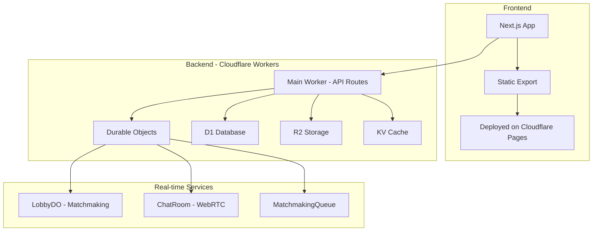
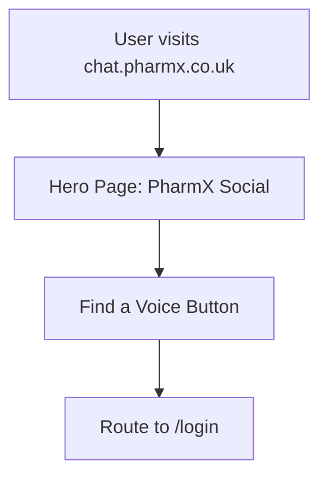
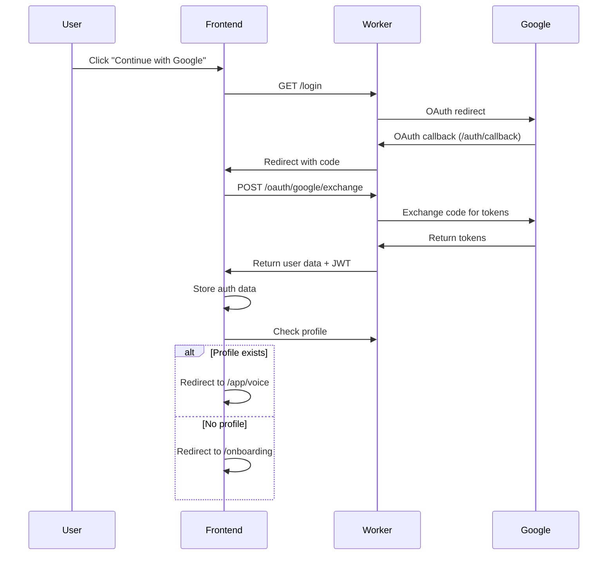
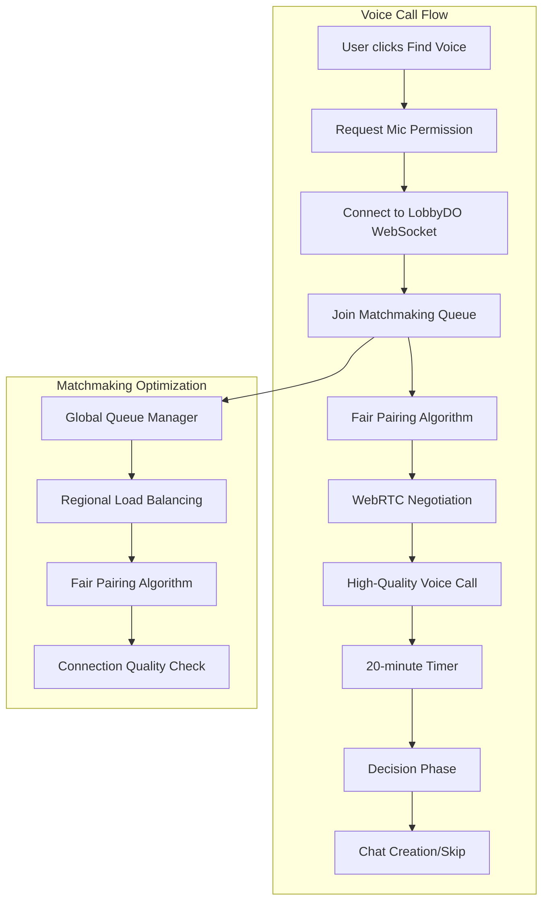
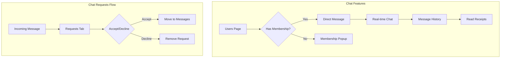
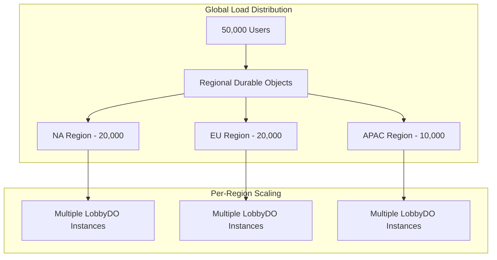

# PharmX Social App - Evaluation & Optimization Design

## Overview

This document provides a comprehensive evaluation and optimization design for the PharmX Social app, focusing on delivering a fast, seamless user experience without changing the UI design. The app is a serverless voice chat platform built with Next.js and Cloudflare Workers/Durable Objects.

**Key Requirements:**
- Maintain existing UI/design
- Fix logic and optimize performance
- Ensure fast, seamless user experience
- No backend - purely serverless with Cloudflare
- Handle high concurrency (50,000+ users)
- WhatsApp/Telegram-level call quality

## Technology Stack & Architecture



## Current Architecture Assessment

### Strengths
- **Serverless Architecture**: Scalable Cloudflare Workers infrastructure
- **Real-time Capabilities**: Durable Objects handle stateful connections
- **Global Distribution**: Cloudflare edge network for low latency
- **Modern Tech Stack**: Next.js, TypeScript, Tailwind CSS

### Critical Issues Identified

#### 1. Authentication Flow Problems
- **Issue**: OAuth redirect URI mismatch between `/oauth/callback` and `/auth/callback`
- **Impact**: Users cannot complete authentication
- **Solution**: Standardize on `/auth/callback` across all components

#### 2. WebRTC Implementation Gaps
- **Issue**: Voice page uses mock data instead of real WebRTC connections
- **Impact**: No actual voice calls possible
- **Solution**: Implement proper WebRTC signaling through Durable Objects

#### 3. Database Schema Inconsistencies
- **Issue**: Missing tables and incomplete schema
- **Impact**: Profile creation and chat functionality broken
- **Solution**: Complete database schema implementation

#### 4. Performance Bottlenecks
- **Issue**: Inefficient matchmaking algorithm
- **Impact**: Poor user experience with 50K+ concurrent users
- **Solution**: Implement fair queuing and load balancing

## Optimized User Flow Design

### Step 1: Landing Page


**Optimization Points:**
- Preload critical resources
- Implement service worker for offline capability
- Optimize shader animation performance

### Step 2-3: Authentication Flow



**Critical Fixes:**
1. Fix OAuth endpoint mismatch
2. Implement proper JWT validation
3. Add profile existence check
4. Optimize token refresh mechanism

### Step 4: Onboarding Optimization

**Current Issues:**
- No file upload validation
- Missing age verification
- No bio length enforcement

**Optimizations:**
```typescript
// Enhanced profile validation
interface ProfileData {
  name: string;          // Required, 2-50 chars
  gender: 'male' | 'female'; // Required, immutable
  dateOfBirth: string;   // Required, must be 18+
  bio: string;          // Required, max 160 chars
  avatar?: File;        // Optional, max 10MB
}

// Optimized upload flow
const uploadAvatar = async (file: File): Promise<string> => {
  // Client-side compression
  const compressed = await compressImage(file, { maxWidth: 512 });
  
  // Direct R2 upload with presigned URL
  const presignedUrl = await getUploadUrl();
  await uploadToR2(presignedUrl, compressed);
  
  return getPublicUrl(presignedUrl);
};
```

### Step 5-6: Main App Navigation

**Bottom Navigation Optimization:**
- Implement service worker for instant navigation
- Preload critical pages
- Add navigation state persistence

## Voice Call System Optimization

### Current Problems
1. **Mock Implementation**: No real WebRTC connections
2. **No Matchmaking Logic**: Users aren't actually paired
3. **Missing Audio Configuration**: No quality optimization
4. **No Scalability**: Can't handle 50K+ users

### Optimized Voice Architecture



### WebRTC Quality Configuration
```typescript
const audioConstraints = {
  audio: {
    echoCancellation: true,
    noiseSuppression: true,
    autoGainControl: true,
    sampleRate: 48000,
    channelCount: 1,
    bitrate: 128000, // High quality like WhatsApp
    codec: 'opus'
  }
};

const rtcConfiguration = {
  iceServers: [
    { urls: 'stun:stun.cloudflare.com:3478' },
    {
      urls: 'turn:turn.cloudflare.com:3478',
      username: env.TURN_USERNAME,
      credential: env.TURN_CREDENTIAL
    }
  ],
  iceCandidatePoolSize: 10,
  bundlePolicy: 'max-bundle',
  rtcpMuxPolicy: 'require'
};
```

### Scalable Matchmaking Algorithm

```typescript
class OptimizedMatchmaking {
  private regionalQueues: Map<string, string[]> = new Map();
  private connectionQuality: Map<string, number> = new Map();
  
  async fairPairing(): Promise<[string, string] | null> {
    // Priority: connection quality > wait time > geographic proximity
    const candidates = this.getSortedCandidates();
    
    if (candidates.length < 2) return null;
    
    const [userA, userB] = candidates.slice(0, 2);
    
    // Remove from all queues
    this.removeFromQueues(userA, userB);
    
    return [userA, userB];
  }
  
  private getSortedCandidates(): string[] {
    return Array.from(this.getAllUsers())
      .sort((a, b) => {
        // Sort by wait time (fairness) and connection quality
        const qualityA = this.connectionQuality.get(a) || 0;
        const qualityB = this.connectionQuality.get(b) || 0;
        const waitA = this.getWaitTime(a);
        const waitB = this.getWaitTime(b);
        
        // Fair algorithm: longer wait time gets priority
        if (Math.abs(waitA - waitB) > 30000) { // 30 second threshold
          return waitB - waitA; // Longer wait first
        }
        
        // Similar wait times, prioritize better connection
        return qualityB - qualityA;
      });
  }
}
```

## Chat System Optimization

### Current Issues
1. **Missing Implementation**: No actual chat functionality
2. **No Message History**: Database schema incomplete
3. **No Real-time Updates**: WebSocket not implemented
4. **No Membership Logic**: Free vs paid features unclear

### Optimized Chat Architecture



### Database Schema Optimization
```sql
-- Optimized chat tables
CREATE TABLE chats (
    id TEXT PRIMARY KEY,
    user1_id TEXT NOT NULL,
    user2_id TEXT NOT NULL,
    created_at DATETIME DEFAULT CURRENT_TIMESTAMP,
    last_message_at DATETIME,
    user1_unread_count INTEGER DEFAULT 0,
    user2_unread_count INTEGER DEFAULT 0,
    status TEXT DEFAULT 'active' -- active, blocked, deleted
);

CREATE TABLE messages (
    id TEXT PRIMARY KEY,
    chat_id TEXT NOT NULL,
    sender_id TEXT NOT NULL,
    content TEXT NOT NULL,
    message_type TEXT DEFAULT 'text', -- text, image, voice
    sent_at DATETIME DEFAULT CURRENT_TIMESTAMP,
    read_at DATETIME,
    deleted_at DATETIME,
    FOREIGN KEY (chat_id) REFERENCES chats(id)
);

CREATE TABLE chat_requests (
    id TEXT PRIMARY KEY,
    from_user_id TEXT NOT NULL,
    to_user_id TEXT NOT NULL,
    message TEXT,
    status TEXT DEFAULT 'pending', -- pending, accepted, declined
    created_at DATETIME DEFAULT CURRENT_TIMESTAMP,
    responded_at DATETIME
);
```

## Performance Optimizations

### 1. Frontend Optimizations
```typescript
// Implement virtual scrolling for large user lists
const VirtualizedUserList = () => {
  const [visibleUsers, setVisibleUsers] = useState([]);
  
  useEffect(() => {
    // Load users in batches of 50
    const loadUsers = async (offset: number) => {
      const users = await fetchUsers({ limit: 50, offset });
      setVisibleUsers(prev => [...prev, ...users]);
    };
    
    loadUsers(0);
  }, []);
  
  return <VirtualList items={visibleUsers} />;
};

// Implement WebSocket connection pooling
class WSConnectionManager {
  private connections: Map<string, WebSocket> = new Map();
  
  getConnection(endpoint: string): WebSocket {
    if (!this.connections.has(endpoint)) {
      const ws = new WebSocket(endpoint);
      this.setupReconnection(ws, endpoint);
      this.connections.set(endpoint, ws);
    }
    return this.connections.get(endpoint)!;
  }
}
```

### 2. Backend Optimizations
```typescript
// Implement connection pooling for D1
class DatabasePool {
  private pool: D1Database[] = [];
  
  async query(sql: string, params: any[]): Promise<any> {
    const db = this.getConnection();
    try {
      return await db.prepare(sql).bind(...params).all();
    } finally {
      this.releaseConnection(db);
    }
  }
}

// Implement caching layer
class CacheManager {
  constructor(private kv: KVNamespace) {}
  
  async getUserProfile(userId: string): Promise<UserProfile | null> {
    // Try cache first
    const cached = await this.kv.get(`profile:${userId}`);
    if (cached) return JSON.parse(cached);
    
    // Fetch from database
    const profile = await this.fetchFromDB(userId);
    if (profile) {
      // Cache for 1 hour
      await this.kv.put(`profile:${userId}`, JSON.stringify(profile), {
        expirationTtl: 3600
      });
    }
    
    return profile;
  }
}
```

### 3. Real-time Optimizations
```typescript
// Implement efficient message broadcasting
class OptimizedBroadcaster {
  private connections: Map<string, WebSocket[]> = new Map();
  
  async broadcast(roomId: string, message: any): Promise<void> {
    const sockets = this.connections.get(roomId) || [];
    
    // Batch send to reduce CPU usage
    const messageStr = JSON.stringify(message);
    const promises = sockets.map(ws => {
      if (ws.readyState === WebSocket.OPEN) {
        return this.sendSafe(ws, messageStr);
      }
    });
    
    await Promise.allSettled(promises);
  }
  
  private async sendSafe(ws: WebSocket, message: string): Promise<void> {
    try {
      ws.send(message);
    } catch (error) {
      console.error('Failed to send message:', error);
      // Remove failed connection
      this.removeConnection(ws);
    }
  }
}
```

## High-Concurrency Handling

### Load Balancing Strategy


### Durable Object Sharding
```typescript
class ShardedLobbyManager {
  private getShardId(userId: string): string {
    // Hash-based sharding for even distribution
    const hash = this.simpleHash(userId);
    const shardCount = 10; // 10 shards per region
    return `lobby-${hash % shardCount}`;
  }
  
  async routeUser(userId: string): Promise<DurableObjectStub> {
    const shardId = this.getShardId(userId);
    return this.env.LOBBY.get(this.env.LOBBY.idFromName(shardId));
  }
}
```

## Error Handling & Monitoring

### Comprehensive Error Recovery
```typescript
class ErrorRecoveryManager {
  async handleWebSocketError(ws: WebSocket, error: any): Promise<void> {
    console.error('WebSocket error:', error);
    
    // Attempt reconnection with exponential backoff
    let retries = 0;
    const maxRetries = 5;
    
    while (retries < maxRetries) {
      try {
        await this.sleep(Math.pow(2, retries) * 1000);
        const newWs = await this.reconnect();
        return newWs;
      } catch (e) {
        retries++;
        if (retries === maxRetries) {
          this.notifyUserOfFailure();
        }
      }
    }
  }
  
  private async notifyUserOfFailure(): Promise<void> {
    // Show user-friendly error message
    this.showToast({
      title: "Connection Lost",
      description: "Please refresh the page to continue",
      variant: "destructive"
    });
  }
}
```

### Performance Monitoring
```typescript
class PerformanceMonitor {
  trackVoiceCallQuality(callId: string, metrics: CallMetrics): void {
    // Track key metrics
    const data = {
      callId,
      latency: metrics.rtt,
      packetLoss: metrics.packetsLost / metrics.packetsReceived,
      jitter: metrics.jitter,
      audioQuality: metrics.audioLevel,
      timestamp: Date.now()
    };
    
    // Send to analytics
    this.sendAnalytics('voice_call_quality', data);
  }
}
```

## Implementation Priority

### Phase 1: Critical Fixes (Week 1)
1. **Fix OAuth Flow**: Standardize redirect URIs
2. **Complete Database Schema**: All required tables
3. **Basic WebRTC**: Real voice connections
4. **Profile System**: Complete CRUD operations

### Phase 2: Core Features (Week 2)
1. **Optimized Matchmaking**: Fair queuing algorithm
2. **Real-time Chat**: WebSocket implementation
3. **File Upload**: Optimized avatar upload
4. **Settings Pages**: Complete all functionality

### Phase 3: Performance & Scale (Week 3)
1. **High-Concurrency Support**: Sharded Durable Objects
2. **Connection Quality**: WebRTC optimizations
3. **Caching Layer**: KV-based caching
4. **Error Recovery**: Comprehensive error handling

### Phase 4: Polish & Optimization (Week 4)
1. **Performance Monitoring**: Analytics implementation
2. **Load Testing**: Simulate 50K users
3. **Security Hardening**: Rate limiting, validation
4. **Documentation**: Complete API documentation

## Expected Performance Improvements

- **Voice Call Connection Time**: < 2 seconds (from current mock)
- **User Matching Speed**: < 5 seconds for 50K concurrent users
- **Page Load Times**: < 1 second (with caching)
- **Real-time Message Delivery**: < 100ms
- **Call Quality**: WhatsApp/Telegram equivalent
- **Uptime**: 99.9% availability
- **Error Rate**: < 0.1% for core functions

This design provides a comprehensive roadmap for transforming the PharmX Social app into a fast, scalable, and reliable voice chat platform while maintaining the existing UI design.